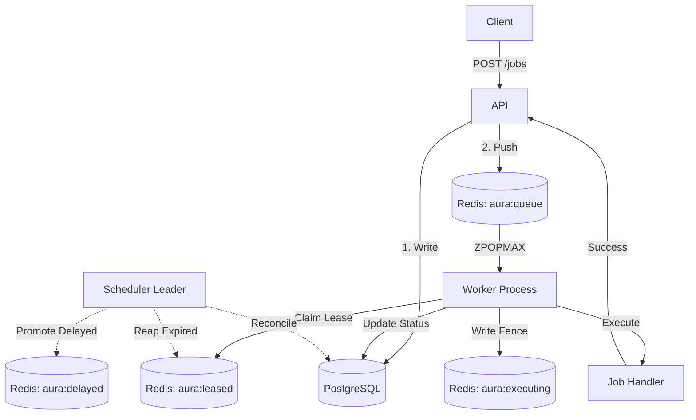

# System Architecture

This document describes the structural components, data flow, and interactions within the Aura distributed job queue.

## Component Overview

### 1. API (Express)
The ingestion layer of the system. 
- **Admission Gate**: Evaluates the adaptive backpressure algorithm to protect the system from overload. If the queue is saturated, it rejects incoming HTTP `POST` requests with a `429 Too Many Requests` status.
- **Persistence**: Writes `PENDING` jobs to PostgreSQL first (for durability) and then pipelines the job into Redis (for high-performance queueing).
- **SSE Stream**: Provides a continuous event stream (`/events/stream`) using Server-Sent Events to push live metrics and job states to the operator console.

### 2. Worker
The execution layer of the system.
- Node.js processes that poll Redis using `ZPOPMAX` (to fetch highest-priority jobs first).
- They manage the **Lease Protocol**:
  1. Claim job from `aura:queue:<priority>`.
  2. Atomically insert into `aura:leased` with a score of `now + lease_TTL`.
  3. Set an idempotency fence (`aura:executing:<jobId>`).
- If execution succeeds, the worker clears the lease, updates Postgres to `COMPLETED`, and emits a success event.
- If execution fails, the worker moves the job to the `aura:delayed` sorted set and updates Postgres to `FAILED`.

### 3. Scheduler
The coordination and recovery layer. The scheduler is a decentralized role; any worker can run the scheduler loop, but a Redis `SET NX EX` lock ensures only one instance acts as the leader at a time.
The scheduler performs four primary loops:
- **Reaper**: Scans `aura:leased` for expired leases. If a lease expires before completion, the job is moved back to the `PENDING` queue.
- **Promoter**: Scans `aura:delayed` for jobs whose exponential backoff TTL has expired, and promotes them to the active queues.
- **Reconciler**: Ensures consistency between Postgres and Redis. It scans for Postgres jobs marked `PENDING` or `PROCESSING` but missing from Redis, reinserting them if necessary.
- **SLO Evaluator**: Checks if the queue latency or dead-letter rate exceeds predefined thresholds and publishes alerts.

### 4. PostgreSQL
The durable source of truth.
- **Job Table**: Stores the definitive state of every job (payload, status, attempts, created/completed timestamps).
- **Worker Table**: Tracks historical metrics on worker health and pool assignments.

### 5. Redis
The high-performance state layer.
- **Priority Queues**: `aura:queue:high`, `aura:queue:default`, `aura:queue:low` (Sorted Sets).
- **Delay Queue**: `aura:delayed` (Sorted Set where score is the target execution time).
- **Lease Tracking**: `aura:leased` (Sorted Set where score is the lease expiration time).
- **Event Bus**: Pub/Sub channels used for broadcasting job lifecycle events to the API's SSE endpoints.

## Data Flow Diagram

## Operator Console & SSE
The `operator-console` frontend receives state purely from backend events.
- **Events**: The API subscribes to Redis Pub/Sub events (e.g., `job_update`, `metrics_update`) and forwards them to connected clients via Server-Sent Events.
- **State Hydration**: On receiving an SSE event, the frontend uses React Query to invalidate and refresh the exact data slice affected, avoiding global polling loops.
